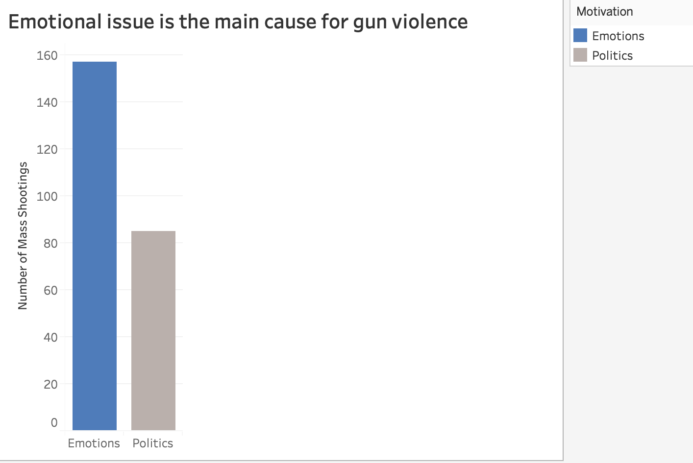
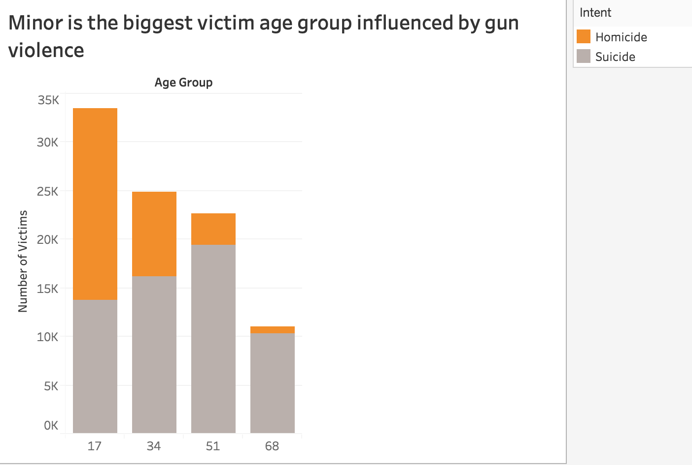
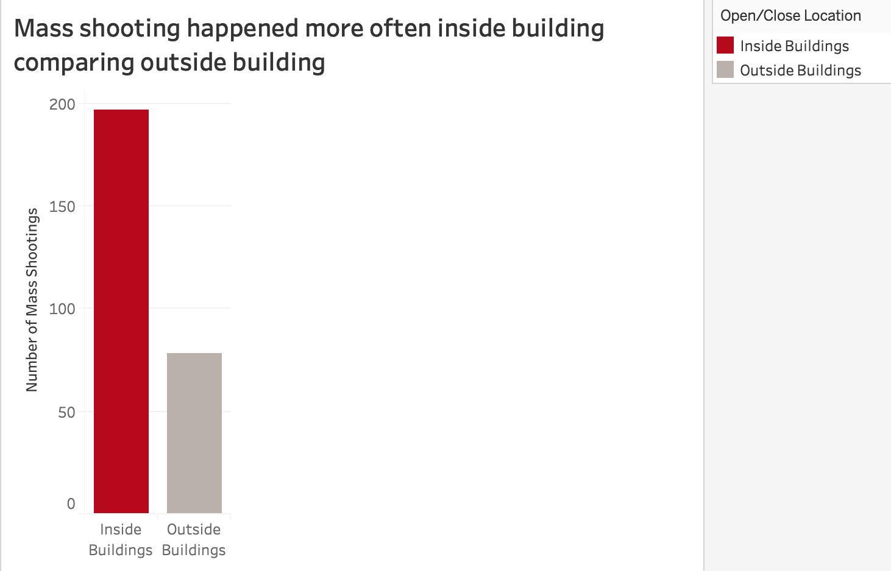
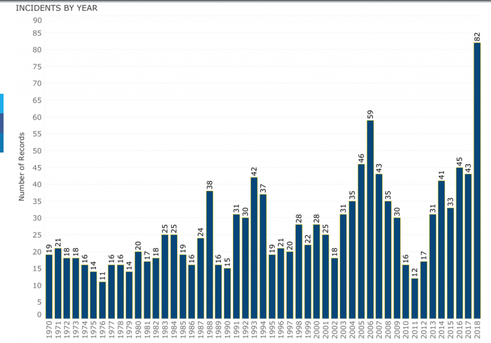

# MSIS 2629 Spring 2019-Gun Violence in United States Project

# Team Members 

Xinran Li

Xin Zou

Chia-cheng Lin

Jui-Chuan Ma

# Project Overview

The topic for the team project is Gun Violence in the United States, and the project is to transform Gun Violence dataset into visualizations, exploring findings and analysising results. The audience of this project is parents does not supprt gun control.

The project is divided into three parts: Data Exploration, First Version, Revised Version. The first version of the porject is developing a narrative that connects at least three interesting, non-trivial, and somewhat unexpected aspects of the topic. Designing Making-of documnets such as developing process, data wrangling steps. Creating road-map with future features/enhancements for the project. 

# Dataset Information

The first dataset contains information about [gun-deaths](https://www.kaggle.com/hakabuk/gun-deaths-in-the-us) in the US from 2012 to 2014 . This dataset includes information about gun-death in the US in the years 2012-2014. The data includes data regarding the victim's age, sex, race, education, intent, time (month and year) and place of death, and weather or not police was at the place of death.

The second dataset is [mass shootings from 1966 to 2017](https://www.kaggle.com/zusmani/us-mass-shootings-last-50-years), it contains detailed information of 398 mass shootings in the United States of America that killed 1996 and injured 2488 people. Mass Shootings in the United States of America (1966-2017) The US has witnessed 398 mass shootings in last 50 years that resulted in 1,996 deaths and 2,488 injured. The latest and the worst mass shooting of October 2, 2017 killed 58 and injured 515 so far. The number of people injured in this attack is more than the number of people injured in all mass shootings of 2015 and 2016 combined. The average number of mass shootings per year is 7 for the last 50 years that would claim 39 lives and 48 injured per year.

# Developing process

### 1. Clean data
**gun-deaths in the US from 2012 to 2014 dataset**: This dataset is very clean, and we have 100798 rows of data. We decided to drop the rows that have NA because they only take up a small portion of our data. Then we optimized the columns which have dummy values, and we changed them into discretional values for easy use in the future visualization. The final dataset has the following columns:

year: The year in which the fatality occurred.

month: The month in which the fatality occurred.

intent : The intent of the perpetrator of the crime. This can be Suicide, Accidental, NA, Homicide, or Undetermined

police : Whether a police officer was involved with the shooting. Either 0 (false) or 1 (true)

sex : The gender of the victim. Either M or F.

age : The age of the victim.

race : The race of the victim. Either Asian/Pacific Islander, Native American/Native Alaskan, Black, Hispanic, or White.

hispanic: A code indicating the Hispanic origin of the victim.

place : Where the shooting took place  

**mass shootings from 1966 to 2017**: The dataset only contains 323 rows of data. We believe that this is acceptable given that the nature of mass shooting events does not happen often. During the cleaning process, first we decided to drop columns that have a lot of NAs, as well as columns that are not useful in our upcoming visualization. Then, for the "Location", we unified them into just State Code for the better statistic. We also simplified the race into six categories: White, African American, Asian, Latino, Native America, and Others. The final dataset has the following columns:

Location: Location where the shooting took place

Date: Date of the shooting

Open/Close Location: Inside the building or open space

Target: Possible target audience or company

Mental Health Issues: Whether the shooter has a mental health issue

Cause: The reason causes the shooting. Terrorism, Hate Crime, Fun (for no obvious reason etc.)

Age: Shooter's age

Employeed (Y/N): Whether the shooter has employeed or not

Employed at: Shooter's employeed location

Fatalities: Total number of people deceased

Injured: Total number of people injured

Policeman Killed: Total number of policeman killed in that event

Race: Race of the shooter

Gender: Gender of the shooter

Latitude/Longtitude: Location of the event

After the cleaning work, we saved the two datasets into excel for the next Tableau step.

### 2. Literature inspiration

In order to better understand Gun Violence topic, and how to use our data to exploring interesting findings, we have searched some related references (news, article, paper, journal, vedios).

### 3.	Visualization by Tableau  
We import the two datasets into Tableau. Trying differenct variable combination to find findings.
The first visualization is based on the mass shooting dataset, we found that Emotional issues are a great motivation for mass shooting, even more than political issues. The second visualization is based on the gun-death dataset, we found that minors who don’t have the right to vote are the biggest victim group in the gun violence, and adults tend to use guns to hurt themselves. The third visualization is based on mass shooting dataset, we found that most victims are killed in the close area which means inside the building, such as school,church and this is one of the most important reason why minor as a biggeest victim age group. These three findings cause us to think deeply and seriously about how to protect minors from gun violence.

### 4. Show finding and analysis results to audience  
The narrative story we are telling is for [National PTA](https://www.pta.org/home/About-National-Parent-Teacher-Association), our target is all American parents who care about their safety and happiness of their children. The parents have the right to vote for their children against gun violence.

### 5. Road-map with future features/enhancements

# Important findings and analysis

## Finding 1
The motivation behind 64% of mass shooting incidents are emotional issues and the rest is political.  

### Data wrangling steps

1. We started by looking online to find existing articles on mass shooting. We were interested to see what facts people find and see if we can either extend their analysis or complement it. 
2. I was intrigued to see that in one half of mass shootings, the shooter had exhibited warning signs that they might harm themselves or others; furthermore, the majority of mass shootings were related to domestic or family violence. Eighty-six percent of mass shooting child fatalities were the results of these incidents (Everytown Research, 2018).
3. We have a variable called "Cause" in our mass-shooting dataset. Some common values you see in this column are "psycho", "terrorism", "domestic dispute", etc. We thought it was appropriate to create another variable called "Motivation" based on this variable.  

### Analysis  
We found that over 64% of mass-shootings from 1966 to 2017 were due to emotional problems of the shooter. Since guns are easy to obtain, people are able to utilize it when they experience some sort of mental breakdown. If someone exhibits dangerous behavior prior to the shooting and the motivation was emotional, we should have laws that capitalize on that window and take away gun possession from the potential shooter, especially when a lot of child victims come from these types of incidents. 

## Finding 2  
Among deaths under firearm, minors is the highest age group of gun violence victims. Minors have a higher chance to be victims of homocide while adults tend to commit suicide.  

### Data wrangling steps

1. Based on the previous finding, we want to look more closely at the child victims in our dataset
2. We have a "Age Group" variable and we were trying to put it against with other variables in our dataset  

### Analysis  
Looking at the chart of homicide-suicide with age group. It shows a terrifying fact that minor age group has a highest rate of being a victim of firearm homicide. Homicide rate is decreased when age is increasing and leads to senior citizens are more likely to die in suicide caused by a firearm. The topic we want to lead out is that the severity of gun violence impacts on United States children and teenagers. According to gun-death dataset, 58 percent are killed by gun related homicides-about 1,100 per year. Children and teenagers are not allowed to vote for firearms control and they are the largest group of gun violence victims. Parents should be aware of how gun violence affects their children and speak up for their kids. Among wealthy, industrialized countries, [91 percent](https://www.ncbi.nlm.nih.gov/pubmed/26551975) of children under 15 killed by guns die in the United States, according to the National Institutes of Health. The same report found that young Americans (ages 15 to 24) are 49 times more likely to die by gunfire than their peers in other high-income countries.[(Kerry Shaw, 2017)](https://www.thetrace.org/2017/07/gun-violence-america-children-kids-facts/)

## Finding 3  
Most victims are killed in the close area which means inside the building, such as school, church and this is one of the most important reason why minor as a biggeest victim age group.  

### Data wrangling steps  
1. In order to figure out why kids is the most injury group, we decide to explore more on mass shooting dataset. We tried the relationship between State and total victim numbers, but quickly realized it might not the reason to cause kids is the biggest injured group.
2. Becasue many mass shooting happened in church or school, we assume that location might be a reason to cause the problem.
3. We rename open and close area to different names which are inside building and outside building to help audience better understanding the graph.
4. By ploting location into Tableau, we have a suprised finding that close area has much higher number of victims than close area.  

### Analysis ###
Because inside building is harder to escape comparing to others, the total victims numbers are much higher than outside building area. Additionally, many inside building tragedy are happened in school or church, these places where minors oftenly go to.  

One article named '2018 was by far the worst year on record for gun violence in schools' mentioned that gun violence in schools are more frequently during recently years, and " there were 94 school gun violence in 2018 — a record high since 1970, which is as far back as the data goes, and 59 percent higher than the previous record of 59 in 2006". The author also post a graph contains the gun violence happened in school from 1970-2018, each year has at least 10 incident happened since 1970. Additionally, many shooters are schools students who has twisted emotion and cause the tragedy happened.  

# Road-map with future features/enhancements

### Limitations

* The data range of Gun-deaths in the US from 2012 to 2014 dataset is very limited, only contains three years information. If we can find more years data, the finding result is more persuasive.  
* In the revised version, we would try to collect more dimentions of the data. If we can have gun ownership information data, or shooter's background information such as whether a shooter is a school students, where did the shooter retrive gun from. We will be able to find more insights related to minor gun violence victims.  
* Three of our graphs use bar chart because it is the best way to explain the finding. However, we will explore more information based on the data and enhance our graphs in revised version.

### Suggestions

In order to decrease minors' injury number from gun violence, here are two different side suggestions to parents based on the article "Keeping Our Schools Safe: A Plan to Stop Mass Shootings and End Gun Violence in American Schools":  

Suggestion 1: Parents suggestions to schools
1. Establishing threat assessment programs in schools to understand and intervene when a student is a risk to themselves or others.
2. Implementing basic security upgrades to prevent access to schools and classrooms.
3. Planning in advance for emergencies so staff can immediately lock out schools and law enforcement can respond quickly.
4. Establishing safe and equitable schools to help reduce gun violence, especially in high-risk communities.

Suggestion 2: Parents suggestions to gun control group
1. Pass Red Flag Laws. Red Flag laws is that law enforcement and family members can act on warning signs of violence, like those that repeatedly occurred in Parkland, and temporarily prevent access to firearms;
2. Encourage Responsible Firearm Storage
3. Requiring background checks on all gun sales so people exhibiting warning signs, minors, and people with dangerous histories can’t evade our gun laws and get their hands on guns.

# Tableau Link  
https://public.tableau.com/profile/xinran.li7719#!/vizhome/5F_15589161532350/V1

# References  

1. Lopez, German. "2018 was by far the worst year on record for gun violence in schools." VOX, 
     www.vox.com/2018/12/10/18134232/gun-violence-schools-mass-shootings. 
     

2. "Keeping Our Schools Safe: A Plan to Stop Mass Shootings and End Gun Violence in American Schools." 
     Everytown for Gun Safety Support Fund, https://everytownresearch.org/reports/keeping-schools-safe-plan-stop-mass-shootings-end-gun-violence-american-schools/

3. Kerry Shaw, "14 Facts That Show How Gun Violence Affects American Kids",https://www.thetrace.org/2017/07/gun-violence-america-children-kids-facts/
